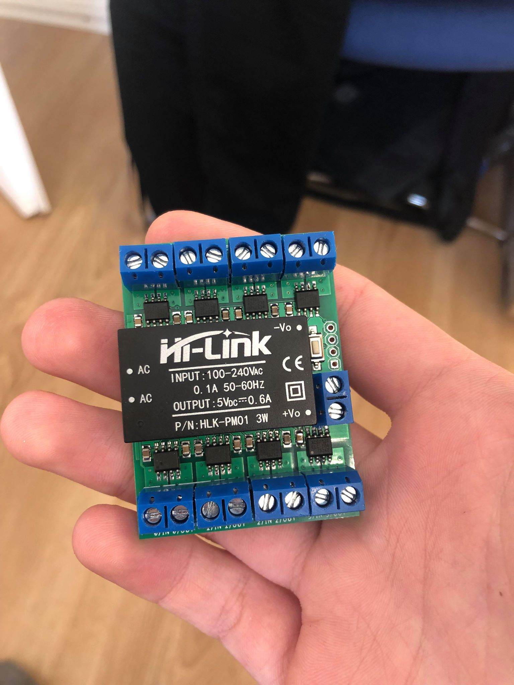

# Powermeter
8-phase induction power meter 16A / 230V

In order to measure the power consumption in each of my rooms, I've designed this induction-based 8 phase power meter, that can be installed in your electricity box next to your breakers.

